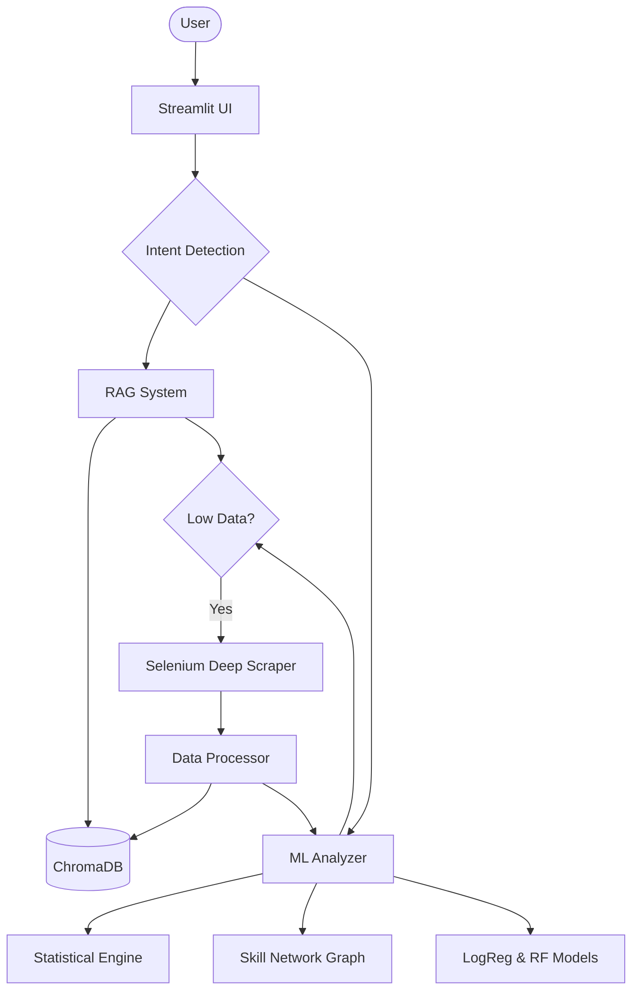

# 🎯 Job Market Intelligence Assistant (v2.0)

**An AI-powered career guidance platform that integrates Machine Learning, RAG, and LLMs to provide personalized, data-driven job market insights.**

Built for the *Leveraging Machine Learning in Business Applications* course (MBA, 2026).

---

## 🚀 Key Features

### 1. 💬 Intelligent Job Inquiry (RAG)
- **Context-Aware Chat:** Converse with an expert career advisor grounded in real-time job market data.
- **Dynamic Scrape Triggers:** If data for your query is sparse, the system autonomously launches a Selenium "Deep Scraper" to fetch live jobs.
- **Intent Detection:** Automatically routes queries into Salary, Skills, Career Path, or General categories for precise analysis.

### 2. 📊 ML-Powered Market Insights
- **Statistical Benchmarks:** Median, IQR, and salary distribution analysis across roles and locations.
- **Emerging Skills:** Growth trend analysis identifying the fastest-growing skills in the market.
- **Salary Premiums:** Statistical impact (LPA boost) of specific skills on total compensation.

### 3. 👤 Profile & Gap Analysis
- **Resume Parsing:** Upload your PDF/Text resume to automatically extract skills.
- **Match Scoring:** Real-time comparison of your profile against market requirements for any target role.
- **Automated Recommendations:** Personalized job matches based on skill overlap and location preferences.

### 4. 🔄 Career Transition Likelihood
- **Logistic Regression Model:** Predicts the probability of a successful transition from your current role to a target career track.
- **Factor Analysis:** Visualizes the impact of skill overlap, experience gaps, and location on your transition success.

### 5. 🤝 Skill Co-occurrence Network (New!)
- **Market Basket Analysis:** Uses the **Apriori algorithm** to discover which skills frequently appear together.
- **Interactive Knowledge Graph:** Visualize skill "communities" (stacks) and identify "bridge skills" using **NetworkX**.
- **Strategic Roadmap:** *"If you learn Python, there is an 87% chance you'll also need SQL."*

---

## 🛠️ Technical Stack

- **Frontend:** Streamlit 1.35+
- **LLM:** Google Gemini 2.5 Flash
- **Orchestration:** LangChain 1.x (Stable)
- **Vector Database:** ChromaDB
- **Embeddings:** HuggingFace (`all-MiniLM-L6-v2`)
- **Scraping:** Selenium (Headless Chrome) & BeautifulSoup4
- **ML & Graph:** Scikit-learn, MLxtend, NetworkX
- **Visualizations:** Plotly (Interactive)

---

## 🏗️ Architecture



---

## 📁 Project Structure

- `app.py`: Main Streamlit application entry point.
- `src/ml_analyzer.py`: Core ML logic (Clustering, Regression, Association Rules, Graphs).
- `src/rag_system.py`: LangChain integration and vector store management.
- `src/scraper_selenium.py`: Headless browser-based job data extraction.
- `src/resume_parser.py`: PDF/Text processing and skill extraction.
- `data/processed/`: Unified source of truth and pre-calculated artifacts.

---

## 🛠️ Setup & Installation

1. **Clone the repository**
2. **Install dependencies:**
   ```bash
   pip install -r requirements.txt
   ```
3. **Configure Environment:**
   Create a `.env` file with your `GOOGLE_API_KEY`.
4. **Run the App:**
   ```bash
   streamlit run app.py
   ```

---

## 🎓 Course Alignment (MBA Trim-6)
- **Session 8:** Logistic Regression for Transition Likelihood.
- **Session 10:** Integration of ML Insights with Generative AI (RAG).
- **Session 11:** Random Forest for Salary Prediction.
- **Session 13:** Supervised Classification for Role Clustering.
- **Session 16:** NLP & Graph Analysis for Skill Networks.
